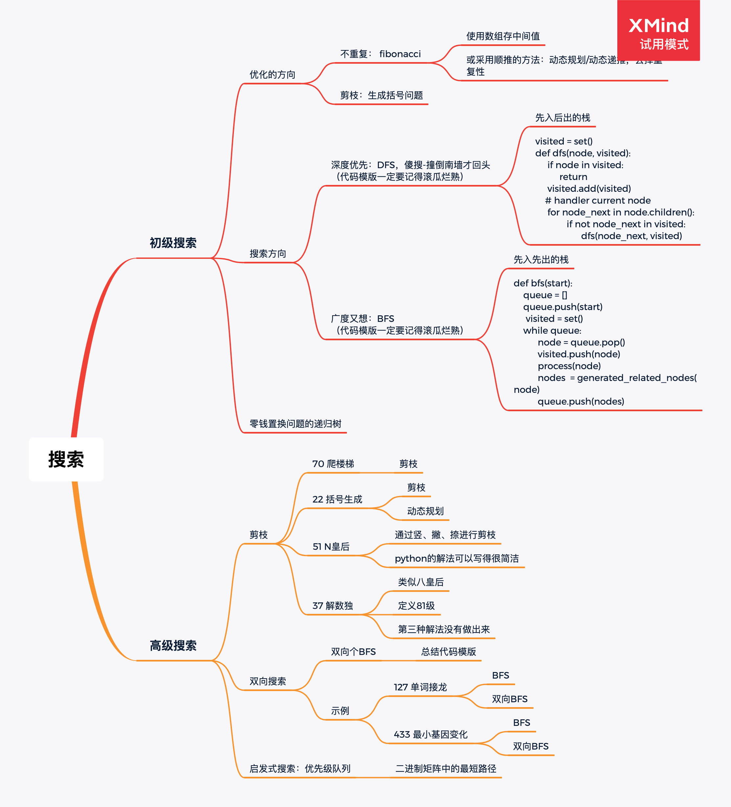

# 07搜索算法.pngLeetCode 练习记录

[toc]

## 零：ARTS

一个关于有趣的活动，叫做：[ARTS](https://github.com/hefrankeleyn/ARTS/tree/master/document/ARTS.md)。

## 一、第一周：20210329—20210405

[第一周的LeetCode练习记录](https://github.com/hefrankeleyn/ARTS/tree/master/document/2021-04-05-LeetCodeWeek01.md)。

### 总结：

1. “k个一组翻转链表”、“滑动窗口最大值”、“滑动窗口最大值”、“接雨水”有些难度；
2. 绝大部分题目，目前只刷了一遍。还没有到网站上看其他人的解题方案；

### 改进：

1. 指定详细的计划，每天都要回顾、刷题；
2. 一定要看看其他人的解法，多刷几遍；
3. 每天都进度表一定要制作出来，并且每天都要复盘。

## 二、第二周：20210406—20210410

[第二周的LeetCode练习记录](https://github.com/hefrankeleyn/ARTS/tree/master/document/2021-04-10-LeetCodeWeek02.md)。

### 总结：

[堆排序（升序和降序）](https://github.com/hefrankeleyn/ARTS/blob/master/LeetCodeWP/src/main/java/com/hef/week02/homework/MyHeapSort.java)

[hashMap的实现](https://github.com/hefrankeleyn/ARTS/tree/master/document/2021-04-11-hashMap的实现.md)

### 改进：

1. 看其他人写的代码，并把好的代码收集起来；

## 三、第三周：20210412—20210418

[第三周的LeetCode练习记录](https://github.com/hefrankeleyn/ARTS/blob/master/document/2021-04-12-LeetCodeWeek03.md)。

### 总结：

### 改进：

## 四、第四周：20210419—20210425

[第四周的LeetCode练习记录](https://github.com/hefrankeleyn/ARTS/blob/master/document/2021-04-23-LeetCodeWeek04.md)。

### 总结：

### 改进：

## 五、第五周：20210430-20210505

[第五周的LeetCode练习记录](https://github.com/hefrankeleyn/ARTS/blob/master/document/2021-05-03-LeetCodeWeek05.md)。

### 总结：

### 改进：

## 六、第六周： 20210505-20210516

[第六周的LeetCode练习记录](https://github.com/hefrankeleyn/ARTS/blob/master/document/2021-05-16-LeetCodeWeek06.md)。

### 总结：

### 改进：

向优秀的同学学习

## 七、第七周： 20210517-20210523

[第七周的LeetCode练习记录](https://github.com/hefrankeleyn/ARTS/blob/master/document/2021-05-22-LeetCodeWeek07.md)。

### 总结：

### 改进：

