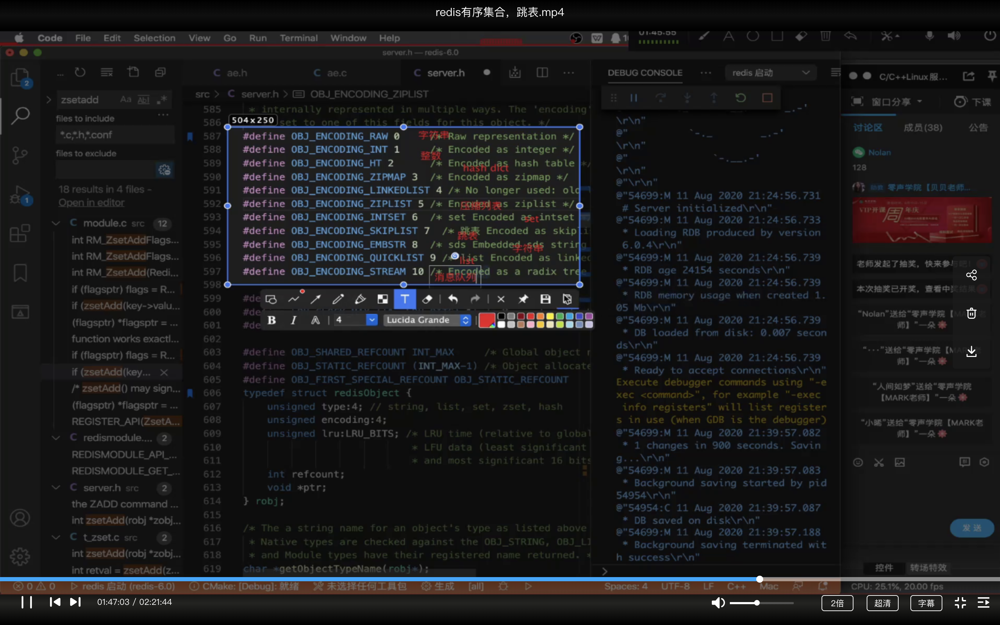

# 数据结构与算法

[toc]

## 一、数据结构

### 1.1 BST、AVL、Red-Black BST

- [BST 二分搜索树](https://gitee.com/lf-ren/java-re-new-builder/blob/master/projects/pro03Algorithm/src/main/java/com/hef/review1/tree/BinarySearchTree.java)
- [AVL 平衡二分搜索树](https://gitee.com/lf-ren/java-re-new-builder/blob/master/projects/pro03Algorithm/src/main/java/com/hef/review1/tree/AVLTree.java)
- [Red-Black BST 红黑二分搜索树](https://gitee.com/lf-ren/java-re-new-builder/blob/master/projects/pro03Algorithm/src/main/java/com/hef/review1/tree/RedBlackBST.java)

### 1.2 Trie 字典树

- [Trie 字典树](https://gitee.com/lf-ren/java-re-new-builder/blob/master/document/week3-%E7%AE%97%E6%B3%95%E3%80%81springBoot/2021-10-03-%E5%AD%97%E5%85%B8%E6%A0%91%E5%8F%8A%E7%BB%8F%E5%85%B8%E9%A2%98%E7%9B%AE.md)

### 1.3 Union-find 并查集

- [Union-Find 并查集](https://gitee.com/lf-ren/java-re-new-builder/blob/master/document/week3-%E7%AE%97%E6%B3%95%E3%80%81springBoot/2021-10-04-UnionFind%E5%B9%B6%E6%9F%A5%E9%9B%86%E5%8F%8A%E7%9B%B8%E5%85%B3%E9%A2%98%E7%9B%AE.md)

### 1.4 数组 Array List、链表 LinkedList、跳表 SkipList

- 数组：随机查询的时间复杂度为O(1) ，插入、删除的时间复杂度为O(n)

- 链表：随机查询的时间复杂度为O(n)，插入、删除的时间复杂度为O(1)

#### 跳表 Skip list

- 跳表只能用于（链表里的）元素有序的情况。

- 跳表对标的是平衡树（AVL Tree）、二分查找，是一种插入、删除、搜索时间复杂度搜是O(logn)的数据结构。

跳表的使用案例：Redis、LevelDB


redis: 有序集合是如何存储的

```
1. 当有序集合中的节点数量小于128的时候，并且所有节点member的长度小于64 的时候使用ziplist；
2. 当有序集合不满足上面两个任意一个条件的时候，改为使用skiplist；
(ziplist 是一个字节数组)
```

redis 如何解决：数据量小的时候没有体现出跳表的优势（会出现多层级）：

```
1. 节点数量小于128 的时候使用ziplist；
2. redis 跳表 最大层级 32 （）
```

```
redis 的对象类型有哪些？底层的数据结构（有序集合 hash）；
zset的底层使用什么数据结构实现的
```



redis为啥使用跳表，而不使用红黑树？

```
1. 红黑树实现复杂，跳表实现简单；
2. zrange(0, -1) 和红黑树一样， 但 zrange(10, 100) 红黑树很难做到；
```


### 1.5 栈、队列、双端队列Deque、优先队列Priority Queue

[栈 Stack](https://gitee.com/lf-ren/java-re-new-builder/blob/master/projects/pro03Algorithm/src/main/java/com/hef/stack/MyStack.java)： 先入后出；添加、删除皆为O(1)；

[队列 Queue](https://gitee.com/lf-ren/java-re-new-builder/blob/master/projects/pro03Algorithm/src/main/java/com/hef/stack/MyQueue.java)：先入先出：添加、删除皆为O(1);

> 补充：java种 stack、queue、priority queue 的源码分析

[大顶堆 MinHeap](https://gitee.com/lf-ren/java-re-new-builder/blob/master/projects/pro03Algorithm/src/main/java/com/hef/stack/MaxHeap.java)、[小顶堆](https://gitee.com/lf-ren/java-re-new-builder/blob/master/projects/pro03Algorithm/src/main/java/com/hef/stack/MinHeap.java)、[堆排序](https://gitee.com/lf-ren/java-re-new-builder/blob/master/projects/pro03Algorithm/src/main/java/com/hef/stack/HeapSort.java)

### 1.6 哈希表 HashMap、集合 Set

> 补充：HashMap的源码分析

### 1.7 树、二叉树

- 树的遍历

  前per-order、中in-order、后序post-order

- 二叉搜索树

### 1.8 堆 Heap

- 可以迅速找到一堆数中的最大值或者最小值的数据结构：大顶堆（或大根堆）、小顶堆（或小根堆）
- 二叉堆是堆的一种实现方式：完全二叉树实现堆；

### 1.9 图

- DFS、BFS：因为可能成环，所以一定要加visited
- 连通图的个数；
- 拓扑排序
- 最短路径
- 最小生成树


##  二、算法

### 2.1 [动态规划](https://gitee.com/lf-ren/java-re-new-builder/blob/master/document/week3-%E7%AE%97%E6%B3%95%E3%80%81springBoot/2021-09-14-%E5%8A%A8%E6%80%81%E8%A7%84%E5%88%92.md)

### 2.2 双指针法

### 2.3 左右夹逼，双指针

### 2.4 用栈来解决：

- 最近相关性、洋葱一样的结构
- 经典题目：括号匹配、直方图

### 2.5 用队列来解决

- 滑动窗口


### 2.6 用堆来解决（PriorityQueue）

- 滑动窗口


### 2.7 递归的算法题目

递归代码模版

- 递归终止条件；
- 处理当前层
- 下探到下一层
- 恢复状态

经典题目：

- 生成括号

