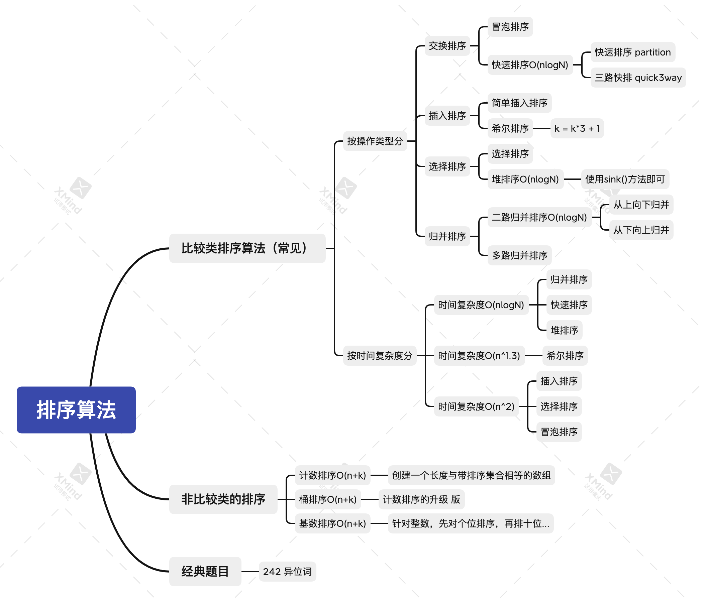

# 各种排序算法

[toc]

##  一、概览

## 二、常见的排序算法

常见的排序算法有：交换排序（冒泡排序、快速排序）、插入排序（普通插入排序、希尔排序）、选择（选择排序、堆排序）、归并排序（从上到下归并、从下到上的归并）。

时间复杂度为O(n^2)：冒泡、插入、选择

时间复杂度为O(n^1.3)：希尔排序

时间复杂度为O(nlogn)：归并排序、快速排序、堆排序

[冒泡排序](https://gitee.com/lf-ren/arts/blob/master/LeetCodeWP/src/main/java/com/hef/review/review01sort/MaoPaoSort.java) 、[选择排序]()、[ 插入排序]()，比较基础，最好练习一下里面的写法。

