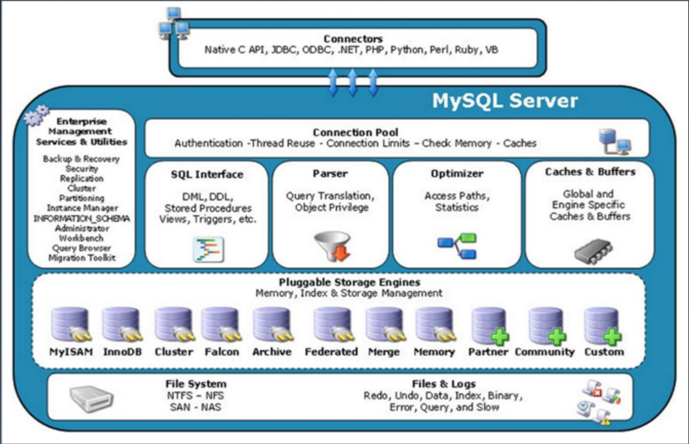
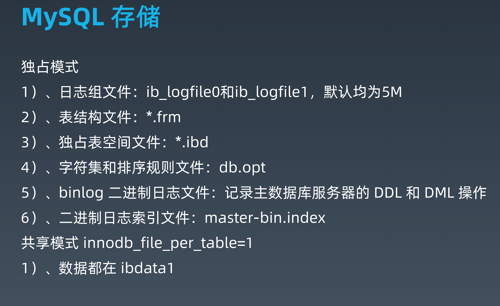

# 性能和SQL高可用

[toc]

## 一、性能优化

性能：一致性、稳定性、可维护性。

衡量性能的两个指标：吞吐、延迟。

通过量化进行性能优化：业务指标。

（脱离场景谈性能都是耍流氓。）

DB/SQL优化是业务系统性能优化的核心。

***延伸：***

- Saas： 软件即服务，功能软件，从单机版变成WEB多租户。（以前买软件，现在不买软件了）
- Paas：平台即服务，基础设施都是共享的，可以在上面部署应用。（中间层，例如：GAE、SAE）
- Laas：云平台（例如：openStack），看起来拿到的就是计算机资源。
- Faas： 函数即服务。ServerLess
- Daas：数据即服务。（暂时不确定怎么搞）


## 二、关系数据库MySQL

关系数据库：以关系代数理论为数学基础。

### 2.1 关系数据库的范式

1NF：每一列都是不可再分的基础数据项；

2NF：每一行都有主键；

3NF：没有列是与主键不相关的；

BCNF：消除重复数据；

4NF：

5NF

## 2.2 常见的数据库

开源： MySQL 、PostgreSQL

商业：Oracle、DB2、SQL Server

### 2.3 SQL语言

- DQL 数据查询语言
- DML 数据操作语言 Insert、delete、update
- TCL 事务控制语言 commit、rollback、savePoint
- DCL 数据控制语言 grant
- DDL 数据定义语言 create、alter、drop
- CCL 指针控制语言

SQL解析器：

1. 手写 druid、mycat；
2. antlr4，shardingsphere；
3. yacc，mysql、tidb、Cockroachdb

## 3.4 MySQL

**mysql5.7:**

- 多主
- MGR高可用
- 分区表
- json
- 性能
- 修复XA

**mysql8.0：**

- 通用表达式
- 窗口函数
- 持久化参数
- 自增列持久化
- 默认编码：utf8mb4
- DDL原子性
- JSON增强
- 不再对group by进行隐式排序

MySQL架构图：





information_schema 存放的是mysql元数据:

```mysql
-- 查询所有的库和表名
select table_schema,table_name from information_schema.tables;
-- 查看表结构：
show columns from tt01;
-- 查看简表语句
show create table tt01;
```

不共享表空间的情况下：文件名和表名一一对应。

### 3.5 MySQL 执行引擎

| 存储引擎 | MYISAM | Innodb | memory | archive |
| -------- | ------ | ------ | ------ | ------- |
| 存储限制 | 256TB  | 64TB   | 有     | 无      |
| 事务     |        | 支持   |        |         |
| 索引     | 支持   | 支持   | 支持   |         |
| 锁粒度   | 表级锁 | 行级锁 | 表级锁 | 行级锁  |
| 数据压缩 | 支持   |        |        | 支持    |
| 外键     |        | 支持   |        |         |

### 3.6 SQL执行顺序

from->on->join->where->group by->having+聚合函数-->select --> order by -->limit

这个顺序不绝对。

### 3.7 索引原理

Innodb 使用B+树实现聚集索引。（B+树只有叶子节点有数据）

**建议：一般单表数据不要超过2000万。**

假设：希望B+树，层级不要超过3层。假设主键类型为BigInt，在mysql中占8个字节，指针大小在mysql中是6个字节。这样一个主键占14字节。一个页在mysql中是16k，16k/14 =1170。这样最大一页，可以放1170个主键。一个高度为2的B+树，可以有16个块，这样可以放16*1170  = 18720条数据。

三层B+树：1170*1170 * 16

## 3.8 安装mysql

- docker 安装：

  ```
  sudo docker search mysql
  ```

  

## 三、深入数据库原理

　[《千亿数据的潘多拉魔盒：从分库分表到分布式数据库.pdf》]()


## 四、MySQL配置优化

```
[mysqld] # 配置server 端参数

[mysql] # 配置client参数
```

### 4.1 连接请求的变量

- max_connections  最大连接数；5000～10000
- back_log
- wait_timeout 和 interative_timeout

### 4.2 缓冲区变量

- key_buffer_size
- **query_cache_size** (查询缓存)：mysql缓存的数据量。不建议每次查询数据量很大
- max_connect_size
- sort_buffer_

## 五、数据库设计优化


